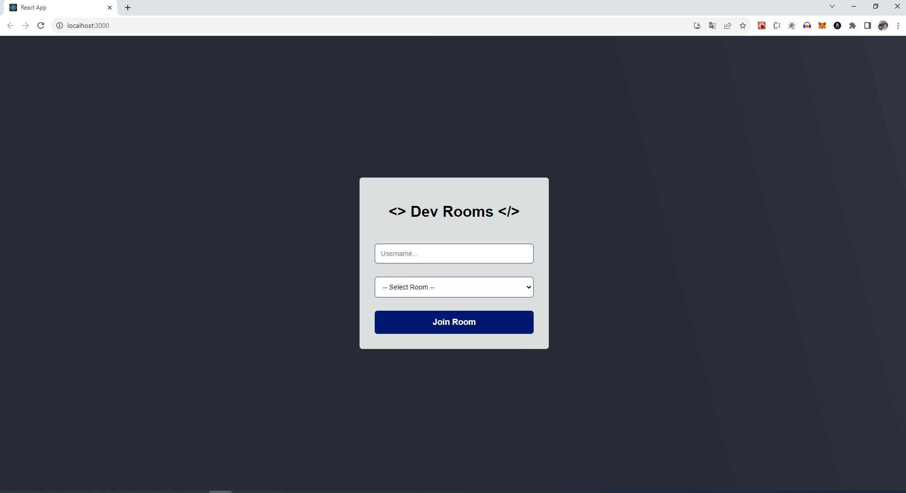

# Real-Time Chat Application

This is a real-time chat application built using Node.js, React.js, and MongoDB. It allows users to chat with each other in real-time and stores chat messages in a MongoDB database.



## Features

- Real-time chat with multiple users.
- Persistent storage of chat messages in MongoDB.
- Responsive design for both desktop and mobile devices.
- User-friendly interface.

## Technologies Used

- **Node.js**: Used for the backend server.
- **Express.js**: Node.js web application framework.
- **Socket.io**: Real-time WebSocket library for enabling real-time communication.
- **React.js**: JavaScript library for building the frontend.
- **MongoDB**: NoSQL database for storing chat messages.
- **Mongoose**: MongoDB object modeling for Node.js.

## Installation

1. Clone the repository:

   ```bash
   git clone https://github.com/fndrorato/chat-nodejs-reactjs.git

2. Navigate to the server directory
    ```bash
    cd real-time-chat-app

3. Install the server the server dependencies:
    ```bash
    npm install

4. Navigate to the client directory:
    ```bash
    cd ..
    cd client

5. Install client dependencies:
    ```bash
    npm install

6. Create a .env file in the server directory and configure your MongoDB URI, e.g.:
    ```bash
    MONGODB_URI=mongodb+srv://dummyuser:<password>@cluster.mongodb.net/?retryWrites=true&w=majority

7. Start the server
    ```bash
    npm run start

8. In a separate terminal, start the client:
    ```bash
    npm start

9. Open your browser and visit http://localhost:3000 to use the chat application.

## Usage
1. Informe your name or nickname
2. Select a room and join a chat room
3. Send and receive real-time chat messages.


